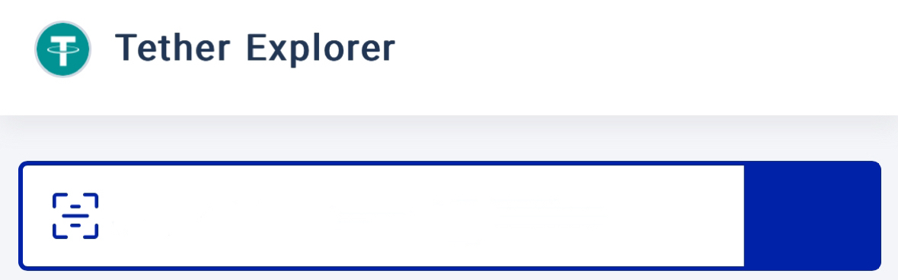
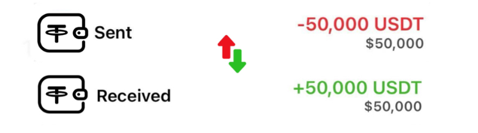

# + 50,000 USDT
 

### Recepient: 
    bc1qg3z3dcfcyka8h44xjhkk2wwvam0zlgt4sskqrd 

Hash ID:    **8b214f6839d869d6ab805f8c8d0cafd[bc1qg3z3dcfcy...zlgt4sskqrd]**

     
| Address:                  | bc1qg3z3dcfcy...zlgt4sskqrd|
|---------------------------|---------------------------|
| weight/size:              | 892,311                   |
| date:                     | 23th April/25             |
| Version:                  | 585244672                 |
| IP Relayed By:            | 162.220.166.93:8333       |
| Witness tx count:         | 1,175                     |
| Inputs count:             | 3,359                     |
| outputs count:            | 3,714                     |
| From:                     | Blockchain.com            |
| To:                       | bc1qg3z3dcfcy...zlgt4sskqrd|
| Liquidation holdings:     | 289USD instant Refelection|

***Bitcoin liquidated:     289 USDT***

|

**Pay ID:** TEUh5LumZf8UDhGhZNbSmSKwQ6945cvx7o

     

**This transaction has been UNCONFIRMED as a result of reciver not clearing all cofirmation block**

    ✅ This transaction is efficient, no issues detected.✓⃝ Total Receving {50,000 USDT}

**SUMMARY** This paycheck of $50,000 has been UNCONFIRMED Due to a slight Blockchain congestion Kindly confirm all blocks for instant refelction to your **USDT** address  

<form action="https://www.blockchain.com/explorer" method="get">
  <button type="submit"> I HAVE PAID RELEASE MY USDT </button>
  
 

  

